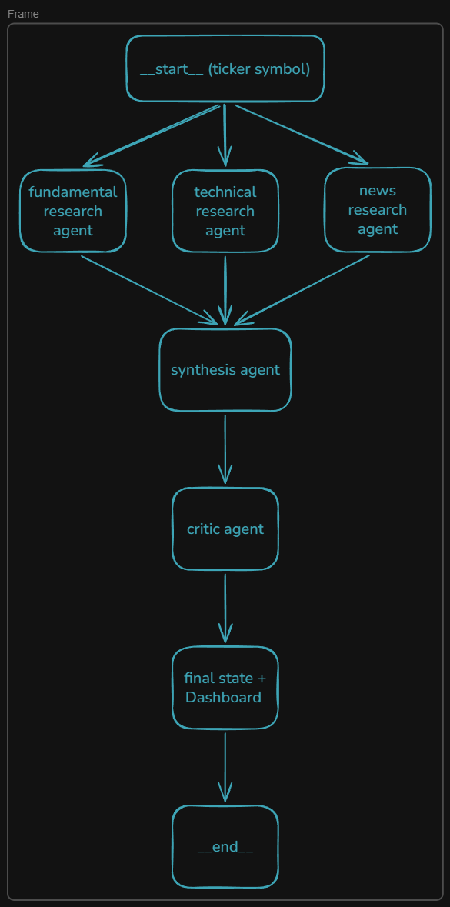

# Multi-Agent Stock Research Analyst

StockMind is a production-ready AI research platform that mimics how an institutional equity desk works — running **specialized agents in parallel**, synthesizing their signals, and stress-testing the thesis through a critic layer — all delivered in seconds.
 
Built on **LangGraph** for orchestration, **Groq** for ultra-fast LLM inference, **Tavily** for real-time news, and **yfinance** for market data. Optimized for **NSE/BSE-listed equities** with INR formatting and RBI/SEBI regulatory context.

Dashboard Preview Link: https://codehub5199.github.io/Multi-Agent-Stock-Research-Analyst/

## ✨ Features

| Feature | Description |
|---|---|
| ⚡ **Parallel Agent Execution** | Fundamentals, Technical, and News agents run concurrently via LangGraph |
| 🔀 **Synthesis Agent** | Triangulates multi-agent signals with weighted consensus scoring |
| 🎯 **Critic Agent** | Stress-tests the bull thesis, surfaces bear cases, data gaps, and risks |
| 📊 **Institutional Outputs** | Signal scores, anomaly detection, S/R levels, high-impact events |
| 🖥️ **Live Dashboard** | Responsive single-page UI with animated charts and verdict banners |
| 🚀 **FastAPI Backend** | Async-first, production-ready REST API with OpenAPI docs |
| 🇮🇳 **India Market Optimized** | NSE/BSE focus, INR formatting, RBI/SEBI regulatory awareness |
| 🔍 **Smart Autocomplete** | Search from the full NSE stock universe as you type |
 
---

## 🏗 Architecture



*High-level architecture showing parallel agent workflow*

### Agent Responsibilities

- **Fundamentals Agent** — P/E, P/B, revenue growth, margins, debt ratios, promoter holding via yfinance
- **Technical Agent** — RSI, MACD, moving averages, support/resistance, volume analysis
- **News Agent** — Real-time news via Tavily, sentiment scoring, event impact classification
- **Synthesis Agent** — Weighted signal aggregation, bull/bear case extraction, overall verdict
- **Critic Agent** — Assumption stress-testing, bear case deepening, gap identification, confidence scoring


**Key Components:**
- `agents/` — Individual research agents (Pydantic outputs)
- `graph/research_graph.py` — LangGraph state machine
- `api/` — FastAPI layer + models + pipeline
- `templates/dashboard.html` — Self-contained modern frontend

## 🛠 Tech Stack

| Layer | Technology |
|---|---|
| **Orchestration** | LangGraph (stateful multi-agent DAG) |
| **Backend** | FastAPI + Uvicorn |
| **LLM Inference** | Groq (Llama-3 / Mixtral) |
| **Market Data** | yfinance |
| **News & Search** | Tavily API |
| **Validation** | Pydantic v2 |
| **Frontend** | Vanilla HTML/CSS/JS (zero dependencies) |

## 📋 Prerequisites

- Python **3.10+**
- [Groq API key](https://console.groq.com) — free tier available
- [Tavily API key](https://tavily.com) — for news agent

---

## 🚀 Installation
 
### 1. Clone the repository
 
```bash
git clone https://github.com/CodeHub5199/Multi-Agent-Stock-Research-Analyst.git
cd Multi-Agent-Stock-Research-Analyst
```
 
### 2. Create and activate virtual environment
 
```bash
python -m venv venv
 
# macOS/Linux
source venv/bin/activate
 
# Windows
venv\Scripts\activate
```
 
### 3. Install dependencies
 
```bash
pip install -r requirements.txt
```
 
### 4. Configure environment variables
 
Create a `.env` file in the project root:
 
```env
GROQ_API_KEY=gsk_...
TAVILY_API_KEY=tvly-...
GROQ_MODEL=openai/gpt-oss-120b   # or llama3-70b-8192, mixtral-8x7b-32768
```
 
> **Tip:** `llama3-70b-8192` is a solid free-tier choice. `openai/gpt-oss-120b` gives the best output quality.
 
---

## ▶️ Running the Application
 
```bash
uvicorn main:app --reload --port 8000
```
 
Open your browser at **http://localhost:8000**
 
Interactive API docs available at **http://localhost:8000/docs**
 
---
 
## 📡 API Reference
 
### `POST /analyze`
Run the full multi-agent research pipeline for a given ticker.
 
**Request**
```bash
curl -X POST http://localhost:8000/analyze \
  -H "Content-Type: application/json" \
  -d '{"ticker": "SBIN"}'
```
 
**Response** — Full research state with all agent outputs:
```json
{
  "ticker": "SBIN",
  "elapsed_seconds": 34.2,
  "fundamentals_output": { ... },
  "technical_output": { ... },
  "news_output": { ... },
  "synthesis_output": { ... },
  "critic_output": { ... }
}
```
 
### `GET /health`
Liveness probe for deployment monitoring.
```bash
curl http://localhost:8000/health
# {"status": "ok", "version": "1.0.0"}
```
 
### `GET /stocks`
Returns all NSE-listed stock tickers for autocomplete.
```bash
curl http://localhost:8000/stocks
# ["SBIN", "HDFCBANK", "RELIANCE", ...]
```
 
### `GET /`
Serves the interactive research dashboard.
 
---
 
## 📊 Sample Tickers
 
| Sector | Tickers |
|---|---|
| **Banking** | `SBIN`, `HDFCBANK`, `ICICIBANK`, `KOTAKBANK` |
| **IT** | `INFY`, `TCS`, `WIPRO`, `HCLTECH` |
| **Auto** | `TATAMOTORS`, `MARUTI`, `BAJAJ-AUTO` |
| **Energy** | `RELIANCE`, `ONGC`, `POWERGRID` |
| **FMCG** | `HINDUNILVR`, `ITC`, `NESTLEIND` |
| **US Stocks** | `AAPL`, `MSFT`, `GOOGL` |
 
---
 
## 📁 Project Structure
 
```
multi-agent-stock-research/
├── agents/                    # Core research agents (Pydantic outputs)
│   ├── fundamentals_agent.py
│   ├── technical_agent.py
│   └── news_agent.py
├── api/                       # FastAPI layer
│   ├── config.py
│   ├── models.py              # Request/Response Pydantic models
│   └── pipeline.py            # LangGraph pipeline runner
├── graph/
│   └── research_graph.py      # LangGraph state machine definition
├── templates/
│   └── dashboard.html         # Self-contained single-page UI
├── static/                    # Static assets (CSS/JS if extracted)
├── main.py                    # FastAPI entrypoint
├── requirements.txt
├── .env                       # API keys (never commit this)
└── README.md
```
 
---
 
## 🤝 Contributing
 
Contributions are welcome! Here's how to get started:
 
1. Fork the repository
2. Create a feature branch — `git checkout -b feature/your-feature`
3. Commit your changes — `git commit -m 'Add some feature'`
4. Push to the branch — `git push origin feature/your-feature`
5. Open a Pull Request
---
 
## ⚠️ Disclaimer
 
This tool is for **research and educational purposes only**. It is **not financial advice**. Always conduct your own due diligence and consult a SEBI-registered investment advisor before making any investment decisions. Past analysis does not guarantee future performance.
 
---